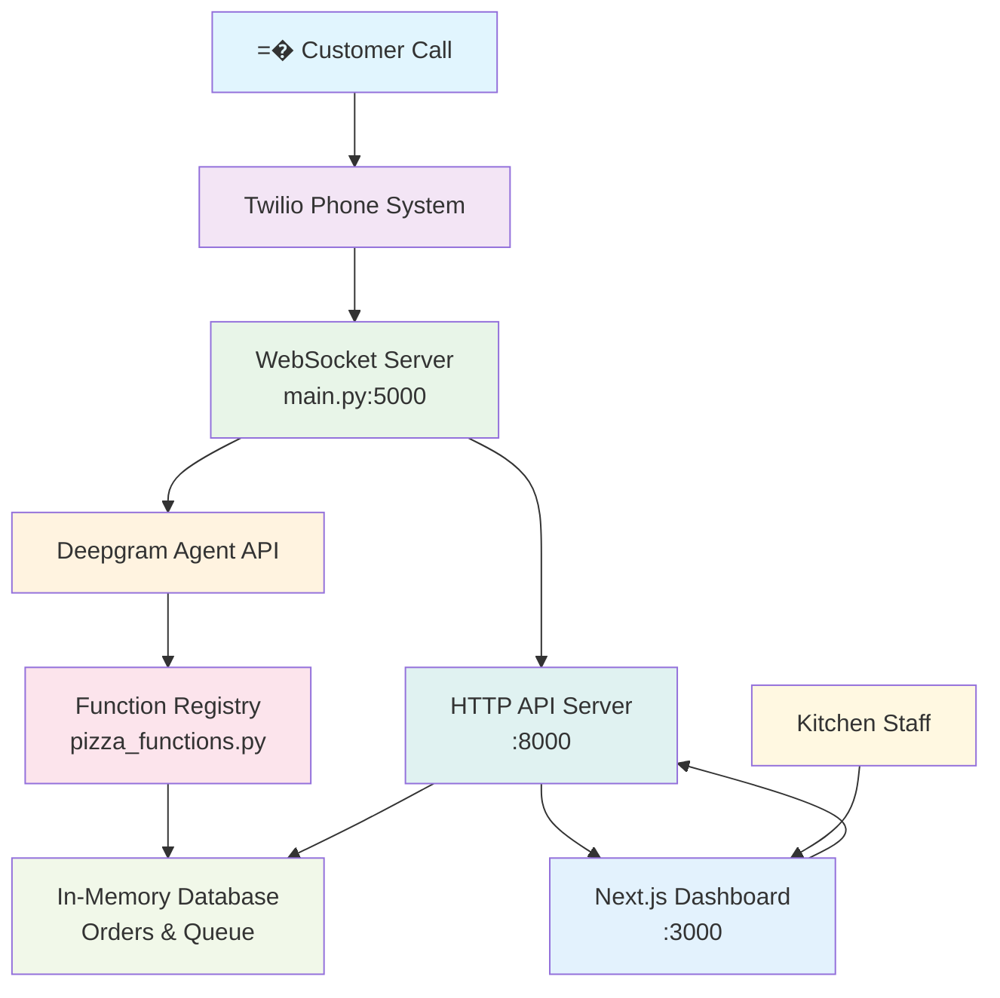

# Zavier's Pizza Voice Agent

A sophisticated voice-enabled pizza ordering system that integrates Deepgram's conversational AI with Twilio telephony and includes a real-time kitchen management dashboard.

## Architecture Overview



## Quick Start

### Prerequisites
- Python 3.12+
- Node.js 18+
- Twilio account with phone number
- Deepgram API key
- ngrok (for local development)

### Environment Setup

1. **Clone and setup Python environment**:
```bash
git clone <repository-url>
cd pizza_agent
uv sync
```

2. **Configure environment variables**:
Create a `.env` file with:
```env
DEEPGRAM_API_KEY=your_deepgram_api_key
TWILIO_ACCOUNT_SID=your_twilio_account_sid
TWILIO_AUTH_TOKEN=your_twilio_auth_token
```

3. **Setup frontend**:
```bash
cd frontend
npm install
```

### Running the System

1. **Start the backend server**:
```bash
uv run main.py
```
This starts:
- WebSocket server on `localhost:5000`
- Dashboard API on `localhost:8000`

2. **Start the frontend dashboard**:
```bash
cd frontend
npm run dev
```
Dashboard available at `http://localhost:3000`

3. **Setup Twilio webhook** (for production):
```bash
# Expose local server
ngrok http 5000

# Configure Twilio webhook URL to:
# https://your-ngrok-url.ngrok.io
```

## System Components

### Backend Architecture

#### **WebSocket Server** (`main.py`)
- **Port**: 5000
- **Purpose**: Handles Twilio telephony connections and real-time audio streaming
- **Key Features**:
  - Bidirectional audio streaming (mulaw, 8kHz)
  - Call state management and automatic termination
  - Real-time call queue tracking
  - Function call orchestration

#### **Function Registry** (`pizza_functions.py`)
- **Business Logic**: Core pizza ordering operations
- **Data Storage**: In-memory database with orders and call queue
- **Available Functions**:
  - `get_menu()` - Complete menu with specialty pizzas, sizes, toppings
  - `place_pizza_order()` - Full order processing with validation
  - `lookup_order()` - Order status and details retrieval
  - `get_dashboard_data()` - Real-time dashboard metrics
  - `update_order_status()` - Kitchen workflow management
  - `update_call_queue()` - Live call tracking

#### **Agent Configuration** (`config.json`)
- **AI Model**: GPT-4o-mini for conversation processing
- **Speech**: Deepgram Nova-3 STT + Aura-2-Helena TTS
- **Conversation Flow**: Structured order collection process
- **Function Schemas**: Detailed parameter definitions

### Frontend Dashboard

#### **Technology Stack**
- **Framework**: Next.js 15 with React 19
- **Styling**: Tailwind CSS with custom retro/pixel theme
- **Components**: Radix UI primitives
- **Real-time Updates**: 5-second polling intervals

#### **Dashboard Features**
- **Call Queue Panel**: Live tracking of active calls and waiting customers
- **Active Orders Panel**: Kitchen workflow with order status management
- **Order Management**: One-click order completion
- **Responsive Design**: Mobile-friendly layout

## Data Flow

### Call Processing Flow
```
1. Customer dials � Twilio receives call
2. Twilio opens WebSocket to main.py:5000
3. Audio streams to Deepgram Agent API
4. AI processes speech � calls functions from pizza_functions.py
5. Function results return to AI � synthesized speech to customer
6. Order placed � 30-second grace period � automatic call termination
```

### Dashboard Updates
```
1. Kitchen staff views dashboard at localhost:3000
2. Dashboard polls API at localhost:8000 every 5 seconds
3. API returns live data from in-memory database
4. Staff can mark orders complete � triggers database update
5. Real-time updates reflect across all dashboard instances
```

## Pizza Menu System

### **Specialty Pizzas**
- Margherita, Pepperoni Classic, Supreme
- Meat Lovers, Vegetarian, Hawaiian
- **Sizes**: Small (10"), Medium (12"), Large (14"), Extra Large (16")
- **Base Prices**: $12.99 - $21.99

### **Build-Your-Own Options**
- **Meat Toppings**: Pepperoni, Sausage, Ham, Bacon, Chicken ($1.50-$2.00)
- **Vegetables**: Mushrooms, Peppers, Onions, Olives, etc. ($1.00-$1.50)
- **Cheeses**: Mozzarella, Parmesan, Feta ($1.50-$2.00)

### **Sides & Drinks**
- Garlic Bread, Wings, Breadsticks, Salads ($5.99-$9.99)
- Soft Drinks, Water, Juice ($1.99-$3.99)

## Conversation Features

### **Natural Speech Processing**
- Conversational AI with natural pauses and transitions
- Context-aware responses optimized for phone conversations
- Step-by-step order collection (name � phone � pickup/delivery � address � items)

### **Smart Order Management**
- Automatic order validation and pricing
- Natural language item recognition
- Speech-optimized confirmations
- Graceful error handling

### **Call Automation**
- Automatic call termination 30 seconds after order completion
- Real-time call queue tracking
- Conversation state management

## Development

### **Backend Development**
```bash
# Install dependencies
uv sync

# Add new dependencies
uv add package_name

# Run server
uv run main.py
```

### **Frontend Development**
```bash
cd frontend

# Install dependencies
npm install

# Development server
npm run dev

# Build for production
npm run build
```

### **Adding New Functions**
1. Implement function in `pizza_functions.py`
2. Add to `FUNCTION_MAP` dictionary
3. Define schema in `config.json` under `agent.think.functions`
4. Update agent prompt if needed

## Data Management

### **In-Memory Storage**
- **Orders**: Complete order history with kitchen status tracking
- **Call Queue**: Real-time active calls and waiting customers
- **Menu**: Full pizza menu with pricing and options

### **Sample Data Structure**
```python
# Order Example
{
    "id": 1,
    "customer_name": "John Smith",
    "phone": "555-0123",
    "order_type": "pickup",
    "items": [
        {
            "type": "pizza",
            "name": "Pepperoni Classic (Large)",
            "size": "large",
            "toppings": ["pepperoni"],
            "quantity": 1
        }
    ],
    "total_price": 18.99,
    "status": "confirmed",
    "kitchen_status": "pending",
    "estimated_time": "25-35 minutes"
}
```

## API Endpoints

### **Dashboard API** (Port 8000)
- `GET /api/dashboard` - Complete dashboard data
- `GET /api/health` - Health check
- `POST /api/orders/{id}/complete` - Mark order complete
- `POST /api/queue/update` - Update call queue

### **WebSocket** (Port 5000)
- Twilio media stream endpoint
- Handles inbound/outbound audio
- Function call processing

## Testing

### **Backend Testing**
```bash
# Test function calls directly
python -c "from pizza_functions import *; print(get_menu())"

# Test API endpoints
curl http://localhost:8000/api/health
```

### **Frontend Testing**
```bash
cd frontend
npm run lint
npm run build
```

## Deployment

### **Production Considerations**
- Replace in-memory database with persistent storage (PostgreSQL, MongoDB)
- Implement proper authentication for dashboard
- Add monitoring and logging (OpenTelemetry)
- Use production-grade WebSocket infrastructure
- Implement proper error handling and retry logic

### **Environment Variables**
```env
# Required
DEEPGRAM_API_KEY=your_api_key
TWILIO_ACCOUNT_SID=your_sid
TWILIO_AUTH_TOKEN=your_token

# Optional
NODE_ENV=production
NEXT_PUBLIC_API_URL=https://your-api-domain.com
```

## Monitoring

### **Call Metrics**
- Active call count tracking
- Call duration monitoring
- Order completion rates
- Customer wait times

### **Kitchen Operations**
- Order queue status
- Preparation times
- Completion tracking
- Daily order volumes

## Contributing

1. Fork the repository
2. Create feature branch (`git checkout -b feature/amazing-feature`)
3. Commit changes (`git commit -m 'Add amazing feature'`)
4. Push to branch (`git push origin feature/amazing-feature`)
5. Open Pull Request

## License

This project is licensed under the MIT License - see the LICENSE file for details.

## Support

- **Issues**: Report bugs and feature requests via GitHub Issues
- **Documentation**: Check CLAUDE.md for development guidelines
- **API**: Deepgram and Twilio documentation for integration details

---

**Built with deepgram for Zavier's Pizza - Where every order is a perfect slice of technology!**